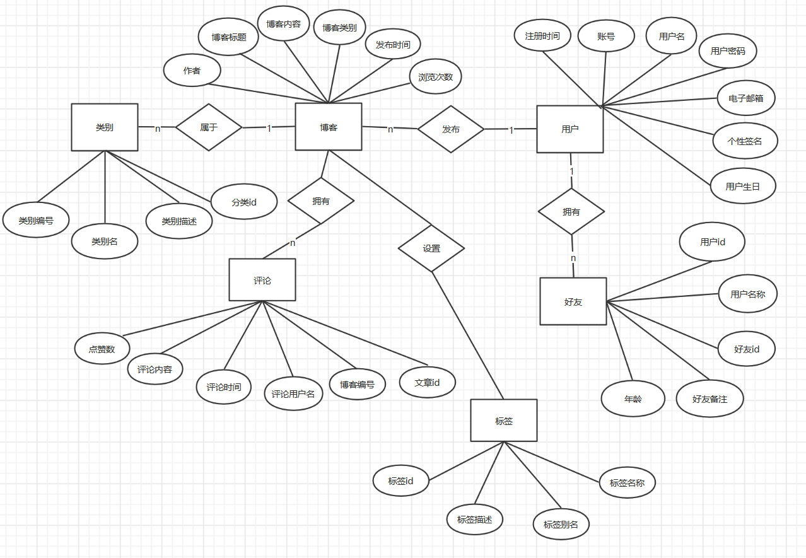
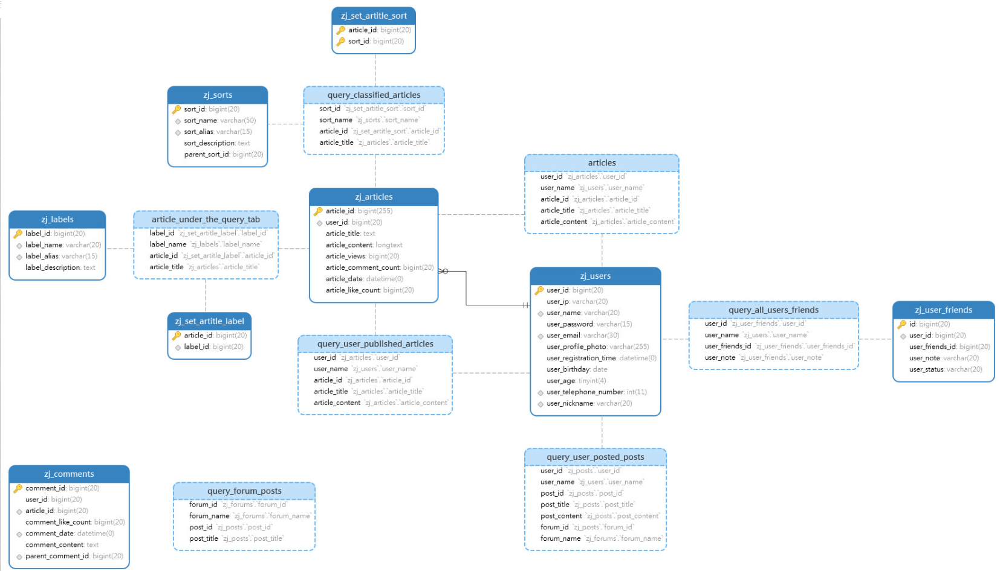
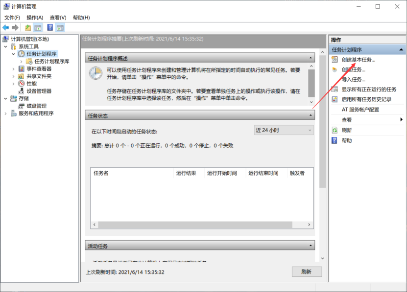
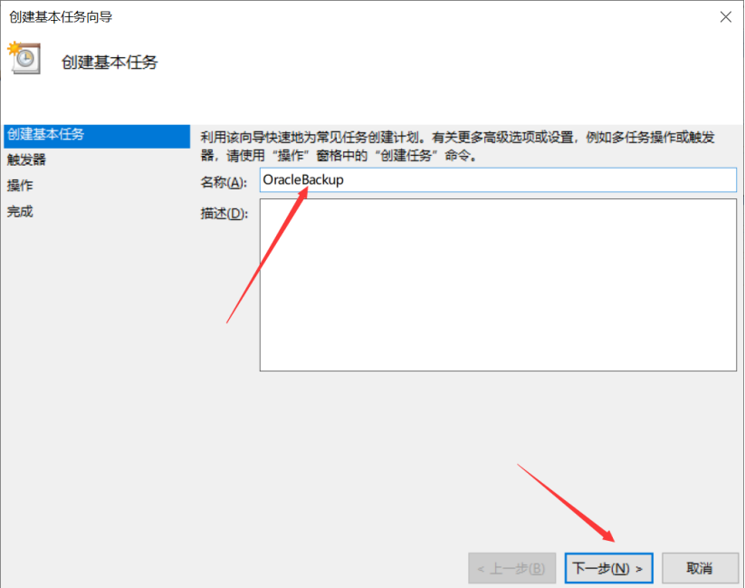
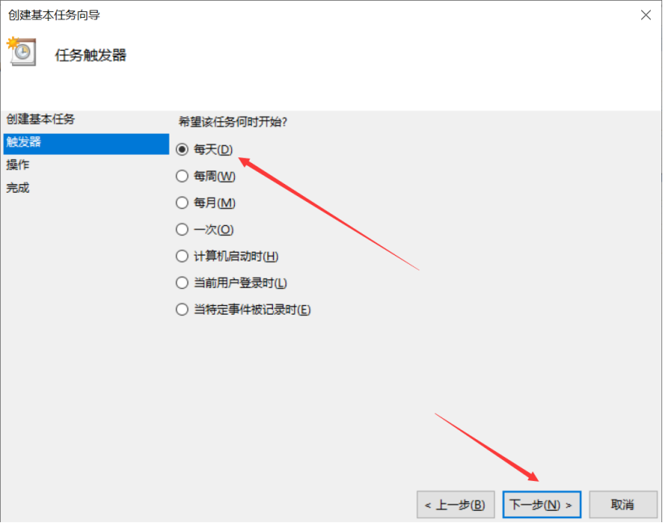
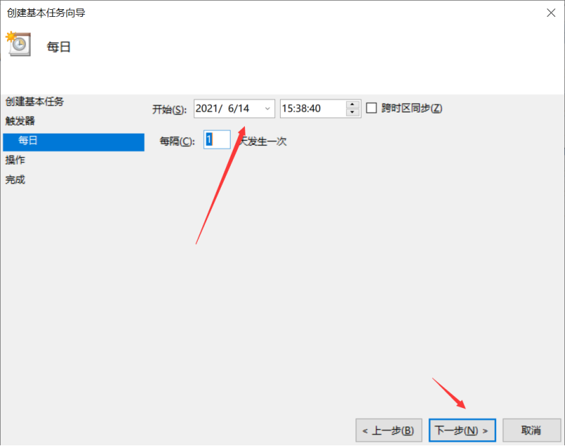
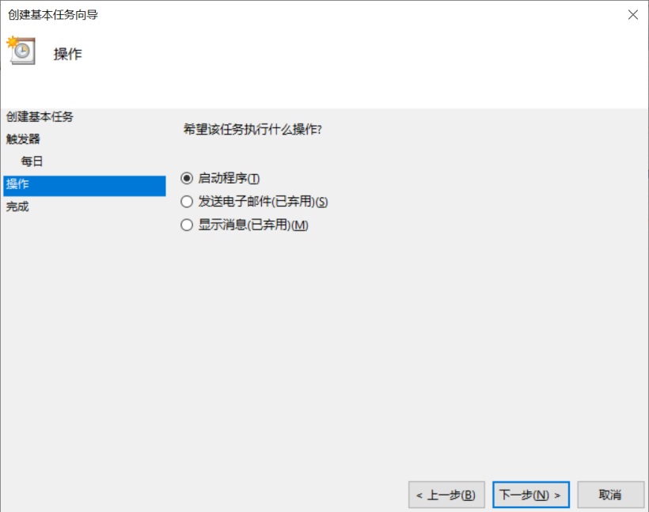
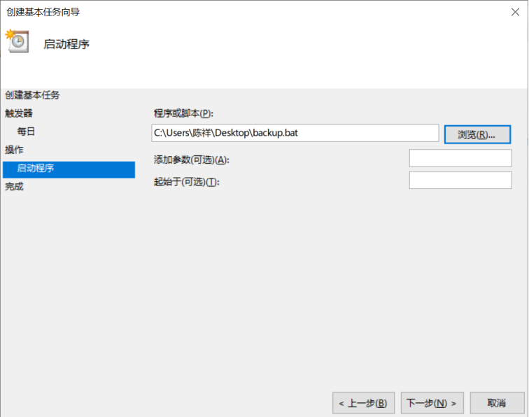
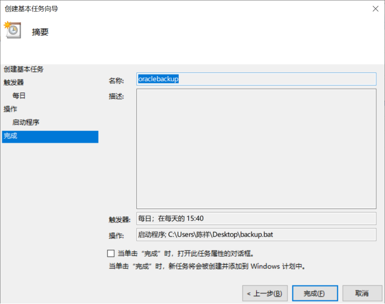

# 实验6（期末考核） 基于Oracle的个人博客系统数据库设计

## 期末考核要求

- 自行设计一个信息系统的数据库项目，自拟某项目名称。
- 设计项目涉及的表及表空间使用方案。至少5张表和5万条数据，两个表空间。
- 设计权限及用户分配方案。至少两类角色，两个用户。
- 在数据库中建立一个程序包，在包中用PL/SQL语言设计一些存储过程和函数，实现比较复杂的业务逻辑，用模拟数据进行执行计划分析。
- 设计自动备份方案或则手工备份方案。

## 1.项目简介

项目名称：博客系统

项目介绍：基于Oracle的个人博客系统数据库设计。

涉及角色/用户：普通用户、游客

涉及表：用户表、游客表、朋友表、文章标签表、文章分类表、内容表、评论表

## 2.功能分析

系统主要完成以下几方面的功能：

用户管理：用户的注册和登录，登录后可以发表博文和评论，点赞。

博文管理：用户可以在网站中对自己的博文进行增删改查。

评论管理：用户可以评论博文和回复其他用户的评论。

分类管理：添加和删除分类，给文章设置分类。

标签管理：添加和删除标签，给文章设置标签。

## 3.E-R图设计



## 4.类图设计



## 5.数据库设计

### **5.1 User表**

| 字段                   | 类型              | 主键，外键 | 可以为空 | 默认值 | 约束 | 说明     |
| ---------------------- | ----------------- | ---------- | -------- | ------ | ---- | -------- |
| user_id                | Integer（20）     | 主键       | 否       |        |      | 用户id   |
| user_ip                | VARCHAR(100 BYTE) |            | 否       |        |      | 用户ip   |
| user_name              | VARCHAR(100 BYTE) |            | 否       |        |      | 用户名   |
| user_password          | VARCHAR(100 BYTE) |            | 否       |        |      | 密码     |
| user_email             | VARCHAR(100 BYTE) |            | 否       |        |      | 邮箱     |
| user_profile_photo     | VARCHAR(255 BYTE) |            | 否       |        |      | 头像     |
| user_registration_time | Date              |            | 否       |        |      | 注册时间 |
| user_birthday          | Integer（20）     |            | 否       |        |      | 用户生日 |
| user_age               | Integer（20）     |            | 否       |        |      | 年龄     |
| user_telephone_number  | Integer（20）     |            | 否       |        |      | 电话     |
| user_nickname          | VARCHAR(100 BYTE) |            | 是       | 空     |      | 昵称     |

### 5.2 Friends表

| 字段            | 类型              | 主键，外键 | 可以为空 | 默认值 | 约束 | 说明     |
| --------------- | ----------------- | ---------- | -------- | ------ | ---- | -------- |
| id              | Integer（20）     | 主键       | 否       |        |      | id       |
| user_id         | Integer（20）     | 外键       | 否       |        |      | 用户id   |
| user_friends_id | Integer（20）     |            | 否       |        |      | 好友id   |
| user_node       | VARCHAR(100 BYTE) |            | 是       | 空     |      | 好友备注 |
| user_status     | VARCHAR(100 BYTE) |            | 否       |        |      | 好友状态 |

### 5.3 分类表

| 字段             | 类型              | 主键，外键 | 可以为空 | 默认值 | 约束 | 说明     |
| ---------------- | ----------------- | ---------- | -------- | ------ | ---- | -------- |
| sort_id          | Integer（20）     | 主键       | 否       |        |      | 分类id   |
| sort_name        | VARCHAR(100 BYTE) |            | 否       |        |      | 分类名称 |
| sort_alias       | VARCHAR(100 BYTE) |            | 否       |        |      | 分类别名 |
| sort_description | VARCHAR(255 BYTE) |            | 否       |        |      | 分类描述 |
| parrent_sort_id  | Integer（20）     |            | 否       |        |      | 父分类id |

### 5.4 博文表

| 字段                  | 类型              | 主键，外键 | 可以为空 | 默认值 | 约束 | 说明       |
| --------------------- | ----------------- | ---------- | -------- | ------ | ---- | ---------- |
| article_id            | Integer（20）     | 主键       | 否       |        |      | 博文id     |
| user_id               | Integer（20）     |            | 否       |        |      | 发表用户id |
| article_title         | VARCHAR(255 BYTE) |            | 否       |        |      | 博文标题   |
| article_content       | VARCHAR(100 BYTE) |            | 否       |        |      | 博文内容   |
| article_views         | Integer（20）     |            | 否       |        |      | 浏览量     |
| article_comment_count | Integer（20）     |            | 否       |        |      | 评论总数   |
| article_date          | DATETIME          |            | 是       | 空     |      | 发布时间   |
| article_like_count    | Integer（20）     |            | 否       |        |      | 点赞数     |

### 5.5 评论表

| 字段               | 类型              | 主键，外键 | 可以为空 | 默认值 | 约束 | 说明       |
| ------------------ | ----------------- | ---------- | -------- | ------ | ---- | ---------- |
| comment_id         | Integer（20）     | 主键       | 否       |        |      | 评论id     |
| user_id            | Integer（20）     |            | 否       |        |      | 发表用户id |
| article_id         | Integer（20）     |            | 否       |        |      | 评论博文id |
| comment_like_count | Integer（20）     |            | 否       |        |      | 点赞数     |
| comment_date       | DATETIME          |            | 是       | 空     |      | 评论日期   |
| comment_content    | VARCHAR(255 BYTE) |            | 否       |        |      | 评论内容   |
| parent_comment_id  | Integer（20）     |            | 否       |        |      | 父评论id   |

### 5.6 标签表

| 字段              | 类型              | 主键，外键 | 可以为空 | 默认值 | 约束 | 说明     |
| ----------------- | ----------------- | ---------- | -------- | ------ | ---- | -------- |
| label_id          | Integer（20）     | 主键       | 否       |        |      | 标签id   |
| label_name        | VARCHAR(100 BYTE) |            | 否       |        |      | 标签名称 |
| label_alias       | VARCHAR(100 BYTE) |            | 否       |        |      | 标签别名 |
| labei_description | VARCHAR(255 BYTE) |            | 否       |        |      | 标签描述 |


## 6.项目设计

### 创建表空间

```sql
 CREATE TABLESPACE Users02
    DATAFILE
    '/home/oracle/app/oracle/oradata/orcl/pdborcl/date01.dbf'
    SIZE 100M AUTOEXTEND ON NEXT 256M MAXSIZE UNLIMITED,
    '/home/oracle/app/oracle/oradata/orcl/pdborcl/date02.dbf'
    SIZE 100M AUTOEXTEND ON NEXT 256M MAXSIZE UNLIMITED
EXTENT MANAGEMENT LOCAL SEGMENT SPACE MANAGEMENT AUTO;

```

### 创建表

```sql
-- user表的创建
create table manage
(
user_id  number(20) primary key,
user_ip VARCHAR2(20 BYTE） not null,
user_name VARCHAR2(100 BYTE） not null,
user_password VARCHAR2(20 BYTE）not null,
user_email VARCHAR2(100 BYTE） not null,
user_profile_photo VARCHAR2(255 BYTE） not null,
user_registration_time datetime not null,
user_birthday date not null,
user_age number(20) not null,
user_telephone_number number(20) not null,
user_nickname VARCHAR2(100 BYTE）
)
tablespace date01 
pctfree 10 
initrans 1 
maxtrans 255 
storage 
(
initial 64K 
next 1M
minextents 1 
maxextents unlimited 
);
-- Friends表的创建
create table Friends
(
id number(20) primary key,
user_id  number(20) not null,
user_friends_id  number(20) not null,
user_note VARCHAR2(100 BYTE） not null,
user_status VARCHAR2(100 BYTE）
)
tablespace date01 
pctfree 10 
initrans 1 
maxtrans 255 
storage 
(
initial 64K 
next 1M
minextents 1 
maxextents unlimited 
);
-- 分类表的创建
create table sort
(
sort_id number(20) primary key,
sort_name  VARCHAR2(100 BYTE） not null,
sort_alias  VARCHAR2(100 BYTE） not null,
sort_description VARCHAR2(255 BYTE） not null,
parrent_sort_id number(20)
)
tablespace date02 
pctfree 10 
initrans 1 
maxtrans 255 
storage 
(
initial 64K 
next 1M
minextents 1 
maxextents unlimited 
);
-- 博文表的创建
create table article
(
article_id number(20) primary key,
user_id number(20) not null,
article_title VARCHAR2(255 BYTE） not null,
article_content VARCHAR2(100 BYTE） not null,
article_views number(20) not null,
article_comment_count number(20) not null,
artcle_date DATETIME not null,
article_like_count number(20)
)
tablespace date02 
pctfree 10 
initrans 1 
maxtrans 255 
storage 
(
initial 64K 
next 1M
minextents 1 
maxextents unlimited 
);
-- 评论表的创建
create table comment
(
comment_id number(20) primary key,
user_id number(20) not null,
comment_id number(20) not null,
comment_like_count number(20) not null,
comment_date DATETIME not null,
comment_content VARCHAR2(255 BYTE） not null,
parent_comment_id  number(20)
)
tablespace date02 
pctfree 10 
initrans 1 
maxtrans 255 
storage 
(
initial 64K 
next 1M
minextents 1 
maxextents unlimited 
);    
-- 标签表的创建
create table label
(
label_id number(20) primary key,
label_name VARCHAR2(255 BYTE） not null,
label_alias VARCHAR2(100 BYTE） not null,
label_description VARCHAR2(255 BYTE） not null
)
tablespace date02 
pctfree 10 
initrans 1 
maxtrans 255 
storage 
(
initial 64K 
next 1M
minextents 1 
maxextents unlimited 
); 
```

### 添加数据

```sql
-- user表的数据插入20000条
declare 
i int;
user_id  number(20) primary key;
user_ip VARCHAR2(20 BYTE） not null;
user_name VARCHAR2(100 BYTE） not null;
user_password VARCHAR2(20 BYTE）not null;
user_email VARCHAR2(100 BYTE） not null;
user_profile_photo VARCHAR2(255 BYTE） not null;
user_registration_time datetime not null;
user_birthday date not null;
user_age number(20) not null;
user_telephone_number number(20) not null;
user_nickname VARCHAR2(100 BYTE）;
begin
i:=1;
while i<=20000 
loop
user_id:=i;
user_ip:=i;                      
user_name:= 'user'|| i;
user_password := '123'|| i;
user_email := '111222333'|| i;
user_profile_photo :='photo'||i;
user_registration_time :='time'||i;      
user_birthday :='birthday'||i;  
user_age := '18'|| i;
user_telephone_number := '1808494'|| i;
user_nickname := 'fengsheng'||i
insert into user(USER_ID,USER_ID,USER_NAME,USER_PASSWORD,USER_EMAIL,USER_PROFILE_PHOTO,USER_REGISTRATION_TIME,USER_BIRTHDAY,USER_AGE,USER_TELEPHONT_NUMBER,USER_NICKNAME) values (user_id,user_ip,user_name,user_password,user_email,user_profile_photo,user_registration_time,user_birthday,user_age,user_telephone_number,user_nickname);
i:=i+1;
end loop;
commit;
end;
/
-- friends表的数据插入20000条
declare 
i int;
id number(20) primary key;
user_id  number(20) not null;
user_friends_id  number(20) not null;
user_note VARCHAR2(100 BYTE） not null;
user_status VARCHAR2(100 BYTE);
begin
i:=1;
while i<=20000 
loop
id:=i;
user_id:='用户id'||i;                      
user_friends_id:= '好友id'|| i;
user_note := '备注'|| i;
user_status := '状态'|| i;
insert into user(ID,USER_ID,USER_FRIENDS_ID,USER_NOTE,USER_STATUS) values (id,user_id,user_friends_id,user_note,user_status);
i:=i+1;
end loop;
commit;
end;
/
-- 分类表的数据插入20000条
declare 
i int;
sort_id number(20) primary key6;
sort_name  VARCHAR2(100 BYTE） not null;
sort_alias  VARCHAR2(100 BYTE） not null;
sort_description VARCHAR2(255 BYTE） not null;
parrent_sort_id number(20);
begin
i:=1;
while i<=20000 
loop
sort_id:=i;
sort_name:='分类名称'||i;                      
sort_alias:= '分类别名'|| i;
sort_description := '分类描述'|| i;
parrent_sort_id := '父分类id'|| i;
insert into user(ID,USER_ID,USER_FRIENDS_ID,USER_NOTE,USER_STATUS) values (id,user_id,user_friends_id,user_note,user_status);
i:=i+1;
end loop;
commit;
end;
/
-- 博文表的数据插入10000条
declare 
i int;
article_id number(20) primary key;
user_id number(20) not null;
article_title VARCHAR2(255 BYTE） not null;
article_content VARCHAR2(100 BYTE） not null;
article_views number(20) not null;
article_comment_count number(20) not null;
artcle_date DATETIME not null;
article_like_count number(20);
begin
i:=1;
while i<=10000 
loop
article_id:=i;
user_id:=i;
article_title:='博文标题'||i; 
article_content:='博文内容'||i;                      
article_views:= i;
article_comment_count :=  i;
artcle_date:=to_date('2019-7-2','yyyy-mm-dd')+(i mod 60);
article_like_count:= i;
insert into user(ARTICLE_ID,USER_ID,ARTICLE_TITLE,ARTICLE_CONTENT,ARTICLE_VIEWS,ARTICLE_COMMENT_COUNTARTICLE_DATE,ARTICLE_LIKE_COUNT) values (article_id,user_id,article_title,article_content,article_views,article_comment_count,artcle_date,article_like_count);
i:=i+1;
end loop;
commit;
end;
/     
-- 评论表的数据插入10000条
declare 
i int;
comment_id number(20) primary key;
user_id number(20) not null;
comment_id number(20) not null;
comment_like_count number(20) not null;
comment_date DATETIME not null;
comment_content VARCHAR2(255 BYTE） not null;
parent_comment_id  number(20);
begin
i:=1;
while i<=10000 
loop
comment_id:=i;
user_id:=i;
comment_id:=i;
comment_like_count:=i;
comment_date:=to_date('2020-7-12','yyyy-mm-dd')+(i mod 60);
comment_content:='评论内容'||i; 
parent_comment_id:=i;
insert into user(COMMENT_ID,USER_ID,COMMENT_ID,COMMENT_LIKE_COUNT,COMMENT_DATE,COMMENT_CONTENT,PARENT_COMMENT_ID) values (comment_id,user_id,comment_id,comment_like_count,comment_date,comment_content,parent_comment_id);
i:=i+1;
end loop;
commit;
end;
/  
-- 标签表的数据插入10000条
declare 
i int;
label_id number(20) primary key;
label_name VARCHAR2(255 BYTE） not null;
label_alias VARCHAR2(100 BYTE） not null;
label_description VARCHAR2(255 BYTE） not null;
begin
i:=1;
while i<=10000 
loop
label_id:=i;
label_name:='标签名'||i;
label_alias:='标签别名'||i;
label_description:='标签描述'i;
insert into user(LABEL_ID,LABEL_NAME,LABEL_ALIAS,LABEL_DESCRIPTION) values (label_id,label_name,label_alias,label_description);
i:=i+1;
end loop;
commit;
end;
/   
```

### 设计权限及用户分配方案,两类角色，两个用户

```sql
-- 创建角色 
CREATE ROLE Visitor; 
CREATE ROLE User; 
-- 授权角色 
GRANT connect,resource,dba, create table,create view,create trigger, create procedure,create sequence TO user 
GRANT connect,resource, create table,create view,create trigger, create procedure,create sequence TO visitor; 
-- 创建用户 
CREATE Visitor visitor  IDENTIFIED BY 123 DEFAULT TABLESPACE date01; 
-- 创建用户 
CREATE USER user   IDENTIFIED BY 123 DEFAULT TABLESPACE date01,date02; 
-- 分配角色给用户 
GRANT  Visitor TO  visitor; 
GRANT  User TO  user;
```

### 存储过程和函数

```sql
create or replace PACKAGE BODY MyPack IS
  FUNCTION Get_SaleAmount(V_DEPARTMENT_ID NUMBER) RETURN NUMBER
  AS
    N NUMBER(20,2); 
    BEGIN
      SELECT SUM(O.TRADE_RECEIVABLE) into N  FROM ORDERS O,EMPLOYEES E
      WHERE O.EMPLOYEE_ID=E.EMPLOYEE_ID AND E.DEPARTMENT_ID =V_DEPARTMENT_ID;
      RETURN N;
    END;

  PROCEDURE GET_EMPLOYEES(V_EMPLOYEE_ID NUMBER)
  AS
    LEFTSPACE VARCHAR(2000);
    begin
      --通过LEVEL判断递归的级别
      LEFTSPACE:=' ';
      --使用游标
      for v in
      (SELECT LEVEL,EMPLOYEE_ID,NAME,MANAGER_ID FROM employees
      START WITH EMPLOYEE_ID = V_EMPLOYEE_ID
      CONNECT BY PRIOR EMPLOYEE_ID = MANAGER_ID)
      LOOP
        DBMS_OUTPUT.PUT_LINE(LPAD(LEFTSPACE,(V.LEVEL-1)*4,' ')||
                             V.EMPLOYEE_ID||' '||v.NAME);
      END LOOP;
    END;
END MyPack;
```

### 自动备份方案

1、新建 backup.bat脚本

```bat
@echo off
echo ================================================
echo  Windows环境下Oracle数据库的自动备份脚本
echo  1. 使用当前日期命名备份文件。
@echo off
       set curdate=%date:~0,4%%date:~5,2%%date:~8,2%
       set backuppath=D:\backup
       md %backuppath%
       exp scott/tiger@127.0.0.1/orcl file=%backuppath%\%curdate%.dmp owner(scott)       log=%backuppath%\%curdate%.log 
       forfiles /p "D:\backup" /s /m *.dmp /d -30 /c "cmd /c del @file"

exit
```

2.创建 windows任务计划：




















## 7.项目总结

​    本次大作业是对这学期所学的综合时间，在这一次作业中，我设计了一个个人博客的数据库项目，运用到了表及表空间使用方案，涉及到了2个表空间6张表，插入了7万条数据，在权限设计的用户分配方案阶段，我设计了两类角色，游客和用户，用户有更高级的权限，而游客仅仅能够访问别人的文章，和评论的功能。在关于备份的设计上，我借鉴了网上自动备份的方案，通过编写脚本和进行设置，直接进行自动备份。

​	本次项目作为所有所学知识点的综合应用，对于我而言还是一个较大的挑战，在通过搜集相关资料的情况下一步步完成项目，完成这个项目也让我收益颇丰，感觉到了完成项目的成就感。